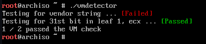

# Virtual-Machine-Detector
Simple code to detect whether you're in a virtual machine or not. 

# Usage
```
git clone https://github.com/CharlotteCross1998/Virtual-Machine-Detector.git
make
./vmdetector
```

# Install
```
git clone https://github.com/CharlotteCross1998/Virtual-Machine-Detector.git
make install
```

# Screenshots



